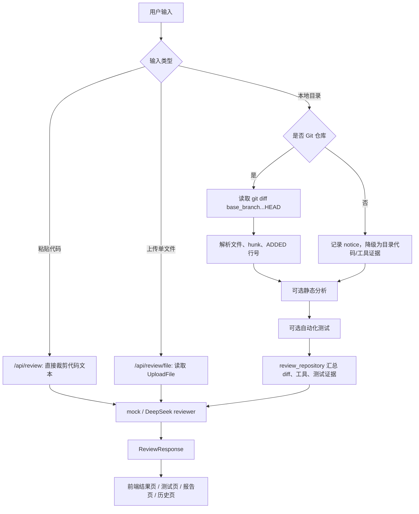

# LLM-CodeReviewer

LLM-CodeReviewer 是一个本地代码评审 MVP。它用 FastAPI 提供后端 API，用静态 HTML 前端提供可操作界面，把代码文本、单文件上传、本地仓库 diff、静态分析、自动化测试和 LLM 评审合并成统一的结构化结果。

这个项目的重点不是训练模型，而是验证一条可落地的代码评审链路：先由后端收集明确证据，再交给 mock reviewer 或 DeepSeek reviewer 生成 `ReviewResponse`，最后由前端展示问题、测试诊断、diff 摘要、Markdown 报告和历史记录。

完整项目说明、流程图、数据结构和阶段复盘见 [docs/project-overview.md](docs/project-overview.md)。

## 当前能力

- `POST /api/review`：评审代码文本，或评审本地项目目录。
- `POST /api/review/file`：上传单个代码文件并直接评审。
- `POST /api/diff`：读取本地 Git 仓库的 `base_branch...HEAD` diff，并返回文件级摘要。
- `POST /api/test`：识别并运行 Python、JavaScript/TypeScript、Java 项目的测试命令。
- Git 仓库路径优先走 diff review，只关注当前分支相对基础分支的变更。
- 非 Git 目录不会被当成代码问题，而是记录 notice，并继续执行可用的静态分析和测试。
- 静态分析支持 Python 的 `ruff`、`mypy`、`bandit`，以及 JS/TS 项目的 `npm run lint`。
- 默认 `LLM_PROVIDER=mock`，没有 API Key 也能完整演示和测试。
- 可切换到 `LLM_PROVIDER=deepseek`，通过 OpenAI SDK 兼容接口调用真实模型。

## 项目结构

```text
code-reviewer-mvp/
  app/
    main.py                  # FastAPI 入口和 API 编排
    schemas.py               # Pydantic 请求、响应、问题和测试模型
    settings.py              # .env 配置读取
    services/
      code_loader.py         # 目录代码读取、过滤和长度裁剪
      diff_loader.py         # Git diff 读取、解析、行号格式化
      llm.py                 # mock / DeepSeek reviewer，以及评审噪声过滤
      static_analysis.py     # ruff、mypy、bandit、npm lint
      test_runner.py         # pytest、npm test、mvn/gradle test
  frontend/
    index.html               # 主界面：任务、结果、测试、报告、历史
    batch-test.html          # 批量测试辅助页面
  docs/
    phase1-guide.md
    phase2-diff-review.md
    phase3-automated-tests.md
    phase4-static-analysis.md
    project-overview.md
  tests/
    test_api.py              # 端到端 API 行为测试
  requirements.txt
  pytest.ini
```

## 核心流程



## 数据结构概览

后端统一返回 `ReviewResponse`：

```json
{
  "summary": "Found 1 issue(s) from combined repository evidence.",
  "issues": [
    {
      "file_path": "calculator.py",
      "source": "ruff",
      "severity": "low",
      "category": "F841",
      "line": 2,
      "message": "Local variable `unused` is assigned to but never used.",
      "suggestion": "Remove the unused variable."
    }
  ],
  "notices": [],
  "test_result": {
    "test_status": "passed",
    "command": "pytest",
    "failed_cases": 0,
    "log_excerpt": "...",
    "llm_explanation": null
  }
}
```

Git diff 路径会把 unified diff 转成 reviewer 更容易使用的上下文，例如：

```text
FILE: calculator.py
HUNK: @@ -1,2 +1,2 @@
ADDED new_line=2:     return a - b
```

因此 Git 项目里的评审意见可以追溯到具体文件和新文件行号。单文件和非 Git 目录在缺少 diff 时仍能评审，但行号证据取决于文件内容、静态分析或测试日志。

## 本地运行

Windows PowerShell:

```powershell
cd D:\profile\code-reviewer-mvp
.\.venv\Scripts\Activate.ps1
pip install -r requirements.txt
uvicorn app.main:app --reload
```

打开：

```text
http://127.0.0.1:8000
```

如果还没有虚拟环境：

```powershell
py -m venv .venv
.\.venv\Scripts\Activate.ps1
pip install -r requirements.txt
copy .env.example .env
uvicorn app.main:app --reload
```

## 环境变量

默认 `.env.example` 使用 mock 模式：

```env
LLM_PROVIDER=mock
DEEPSEEK_API_KEY=
DEEPSEEK_BASE_URL=https://api.deepseek.com
DEEPSEEK_MODEL=deepseek-v4-flash
MAX_CODE_CHARS=24000
```

真实模型调用：

```env
LLM_PROVIDER=deepseek
DEEPSEEK_API_KEY=你的 DeepSeek Key
DEEPSEEK_BASE_URL=https://api.deepseek.com
DEEPSEEK_MODEL=deepseek-v4-flash
```

## API 示例

评审一段代码：

```bash
curl -X POST http://127.0.0.1:8000/api/review \
  -H "Content-Type: application/json" \
  -d "{\"language\":\"python\",\"code\":\"def add(a,b): return a-b\"}"
```

评审本地 Git 仓库，并合并静态分析和测试结果：

```bash
curl -X POST http://127.0.0.1:8000/api/review \
  -H "Content-Type: application/json" \
  -d "{\"language\":\"python\",\"repository_path\":\"D:\\profile\\diff-test-project\",\"base_branch\":\"main\",\"run_static_analysis\":true,\"run_tests\":true}"
```

单独查看 diff：

```bash
curl -X POST http://127.0.0.1:8000/api/diff \
  -H "Content-Type: application/json" \
  -d "{\"repository_path\":\"D:\\profile\\diff-test-project\",\"base_branch\":\"main\"}"
```

单独运行测试：

```bash
curl -X POST http://127.0.0.1:8000/api/test \
  -H "Content-Type: application/json" \
  -d "{\"repository_path\":\"D:\\profile\\diff-test-project\",\"language\":\"python\",\"timeout_seconds\":60}"
```

## 前端速览

主界面包含五个视图：

- 任务页：选择代码文本、单文件或本地目录，配置 base branch、静态分析和测试。
- 结果页：展示总体评分、问题卡片、证据片段、diff 摘要和测试状态。
- 测试页：展示测试命令、状态、失败用例数量、日志摘要和 LLM 测试分析。
- 报告页：生成 Markdown 报告，可下载或通过浏览器打印。
- 历史页：用浏览器 `localStorage` 保存最近评审摘要。

前端评分由 `scoreReview(issues, test)` 计算：高危问题或测试失败为 `C`，中危问题为 `B`，只有低危问题为 `A-`，无问题且测试未失败为 `A`。当前实现没有使用 `D` 档。

## 测试

推荐使用项目虚拟环境运行：

```powershell
D:\profile\code-reviewer-mvp\.venv\Scripts\python.exe -m pytest
```

测试会强制使用 `LLM_PROVIDER=mock`，覆盖代码文本评审、Git diff 评审、base branch 校验、静态分析合并、非 Git 目录降级、测试运行和响应模型等关键行为。
