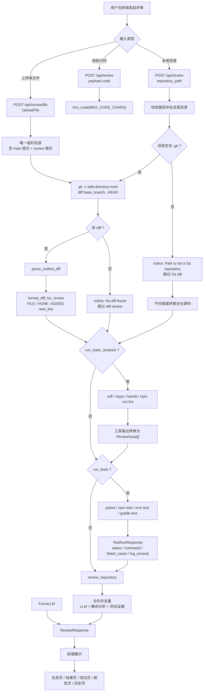

# LLM-CodeReviewer 项目总览

LLM-CodeReviewer 是一个本地代码评审 MVP。它把“代码从哪里来”“有哪些客观证据”“模型应该只基于哪些证据评审”“前端如何展示结果”拆成清晰链路，最终输出统一的 `ReviewResponse`。

项目当前支持三类入口：直接粘贴代码、上传单个文件、输入本地项目目录。本地项目目录又分为 Git 仓库和非 Git 目录：Git 仓库优先 review `base_branch...HEAD` 的变更；非 Git 目录不会伪造 diff，而是记录 notice，并继续利用静态分析、测试和可读取的源码上下文。

## 1. 项目结构

```text
code-reviewer-mvp/
  app/
    __init__.py
    main.py                  # FastAPI 应用、路由和主流程编排
    schemas.py               # ReviewRequest、ReviewResponse、ReviewIssue 等数据结构
    settings.py              # DeepSeek、MAX_CODE_CHARS 配置
    services/
      __init__.py
      code_loader.py         # 代码文本裁剪和受限源码读取工具
      diff_loader.py         # git diff 执行、base branch 校验、unified diff 解析
      llm.py                 # CodeReviewer 抽象和 DeepSeekReviewer
      single_file_workspace.py # 单文件隔离 Git 工作区
      static_analysis.py     # ruff、mypy、bandit、npm run lint
      test_runner.py         # pytest、npm test、mvn test、gradle test
  frontend/
    index.html               # 单页前端主界面
    batch-test.html          # 批量测试辅助页面
  docs/
    phase1-guide.md          # 最小可用版本
    phase2-diff-review.md    # Git diff review
    phase3-automated-tests.md # 自动化测试接入
    phase4-static-analysis.md # 静态分析接入
    project-overview.md      # 当前总览
  tests/
    test_api.py              # API 行为测试
  .env.example
  pytest.ini
  requirements.txt
```

模块职责可以概括为：

| 层级 | 文件 | 职责 |
| --- | --- | --- |
| API 编排 | `app/main.py` | 接收请求、区分路径、组合 diff、静态分析、测试和 reviewer 输出 |
| 数据契约 | `app/schemas.py` | 定义请求、响应、问题、diff、测试结果结构 |
| 配置 | `app/settings.py` | 从 `.env` 读取 provider、DeepSeek 和长度限制 |
| 单文件工作区 | `app/services/single_file_workspace.py` | 创建唯一临时目录、空基线提交和 review 提交 |
| Diff | `app/services/diff_loader.py` | 执行 `git diff <base_branch>...HEAD`，解析文件、hunk 和行号 |
| LLM | `app/services/llm.py` | mock 规则、DeepSeek 调用、JSON 校验、问题过滤和去重 |
| 工具证据 | `app/services/static_analysis.py` | 把本地工具输出转成 `ReviewIssue` |
| 测试证据 | `app/services/test_runner.py` | 自动识别测试命令，返回 `TestRunResponse` |
| 前端 | `frontend/index.html` | 任务配置、执行进度、结果、测试、报告和历史展示 |

## 2. 完整逻辑流程图



三条核心分支：

| 路径 | 输入 | 主要证据 | 是否有 diff 行号 | 适用场景 |
| --- | --- | --- | --- | --- |
| 单文件上传 | 主源码和可选关联测试文件 | 临时仓库 diff、静态分析、测试 | 有。上传文件作为新增文件进入 `main...HEAD` | 快速检查源码，并用关联测试验证业务行为 |
| 代码文本 | 粘贴代码 | 代码文本本身 | reviewer 可给代码行号 | 快速检查独立片段 |
| Git 仓库 | 本地 Git 项目路径 | `base_branch...HEAD` diff、静态分析、测试 | 有。`ADDED new_line=<n>` 可追溯到新文件行号 | 评审当前分支相对基础分支的改动 |
| 非 Git 目录 | 普通本地目录 | 静态分析、测试 | 无 Git diff 行号 | 大型目录的安全降级，不发送全仓源码 |

## 3. 技术栈

| 类型 | 技术 |
| --- | --- |
| 后端框架 | FastAPI |
| 数据模型 | Pydantic、pydantic-settings |
| 服务运行 | Uvicorn |
| LLM SDK | OpenAI Python SDK，使用 DeepSeek 兼容接口 |
| 环境配置 | python-dotenv、`.env` |
| 文件上传 | python-multipart |
| 测试 | pytest、httpx |
| 静态分析 | ruff、mypy、bandit、npm lint |
| 前端 | 原生 HTML/CSS/JavaScript 单页应用 |
| 前端存储 | 浏览器 `localStorage` 保存历史摘要 |
| Git 集成 | 本地 `git diff <base_branch>...HEAD` |

## 4. 核心数据结构

### 4.1 ReviewRequest

```text
language: string = "python"
code: string | null
repository_path: string | null
base_branch: string = "main"
run_tests: boolean = false
run_static_analysis: boolean = true
```

`code` 和 `repository_path` 至少提供一个。`base_branch` 是可配置的，避免把所有仓库都硬编码为 `main`。

### 4.2 ReviewIssue

```text
file_path: string | null
source: string
severity: low | medium | high
category: string
line: integer | null
message: string
suggestion: string
```

`source` 用来说明问题来自哪里，例如 `LLM`、`ruff`、`mypy`、`bandit`、`pytest`、`pytest + LLM`。Git diff 路径下，`file_path` 和 `line` 通常来自 diff 解析后的新文件行号；静态分析路径下则来自工具输出。

### 4.3 ReviewResponse

```text
summary: string
issues: ReviewIssue[]
notices: string[]
test_result: TestRunResponse | null
```

`issues` 是真正的代码问题。`notices` 是流程状态，不应被当成缺陷，例如“当前目录不是 Git 仓库，已跳过 diff review”或“没有发现 base_branch...HEAD 的 diff”。

### 4.4 TestRunRequest / TestRunResponse

```text
repository_path: string
language: string | null
timeout_seconds: integer = 60
```

```text
test_status: passed | failed | no_tests | timeout | unsupported | error
command: string | null
collected_cases: integer | null
passed_cases: integer | null
failed_cases: integer | null
skipped_cases: integer | null
error_cases: integer | null
log_excerpt: string
llm_explanation: string | null
```

`failed_cases` 会从常见测试日志中提取，例如 `<n> failed`、`Tests run: ..., Failures: <n>`、`<n> failing`。如果无法识别失败数量，则返回 `null`。

### 4.5 DiffRequest / DiffResponse

```text
repository_path: string
base_branch: string = "main"
```

```text
base_branch: string
diff: string
files: ChangedFileSummary[]
```

```text
ChangedFileSummary:
  path: string
  additions: integer
  deletions: integer
  hunks: integer
```

## 5. DeepSeek 调用

DeepSeek reviewer 使用 OpenAI Python SDK 的兼容接口：

```text
base_url = DEEPSEEK_BASE_URL
model = DEEPSEEK_MODEL
api_key = DEEPSEEK_API_KEY
```

启用方式：

```env
DEEPSEEK_API_KEY=你的 DeepSeek Key
DEEPSEEK_BASE_URL=https://api.deepseek.com
DEEPSEEK_MODEL=deepseek-v4-flash
```

DeepSeek 路径要求模型返回严格 JSON，并用 `ReviewResponse` 再校验一次。如果模型返回空内容、非 JSON、字段不符合契约，后端会返回 502。提示词里明确要求：只评审可证明的问题，优先返回空 `issues` 而不是猜测。

## 6. Git diff 与行号追踪

Git 项目路径使用：

```text
git -c safe.directory=<root> -C <root> diff <base_branch>...HEAD
```

关键设计：

- `base_branch...HEAD` 表示当前分支相对基础分支的真实变更范围。
- `base_branch` 来自请求参数，可用于 `main`、`master`、`develop` 等分支。
- `safe.directory` 降低 Windows 本地仓库 ownership 限制带来的误报。
- 子进程输出按 UTF-8 读取，并使用 `errors="replace"`，避免编码问题中断评审。
- `base_branch` 会经过字符校验，拒绝空值、以 `-` 开头、包含 `..` 或非法字符的值。

unified diff 会被解析为文件、hunk 和行：

```text
FILE: calculator.py
HUNK: @@ -1,2 +1,2 @@
CONTEXT old_line=1 new_line=1: def add(a, b):
ADDED new_line=2:     return a - b
REMOVED old_line=2:     return a + b
```

这让 reviewer 可以遵守两个约束：

- 只评审 `ADDED` 或修改后的代码行。
- `CONTEXT` 和 `REMOVED` 只用于理解上下文，不作为直接问题来源。

最终问题的 `file_path` 和 `line` 可以落到具体变更文件和新文件行号上，前端也能围绕这些位置展示证据片段。

## 7. 静态分析与测试证据

静态分析输出会直接转成 `ReviewIssue`：

| 工具 | 触发 | 严重程度映射 |
| --- | --- | --- |
| ruff | Python 项目或 `language=python` | `low` |
| mypy | Python 项目或 `language=python` | `medium` |
| bandit | Python 项目或 `language=python` | 按 Bandit severity 映射 |
| npm run lint | 存在 `package.json` 或 JS/TS 语言 | `medium` 的 lint failure |

如果工具未安装、没有对应 npm script，系统会跳过工具，不把“工具缺失”当成代码问题。

测试命令识别：

| 项目类型 | 触发条件 | 命令 |
| --- | --- | --- |
| Python | `language=python`，或存在 `pytest.ini`、`pyproject.toml`、`setup.py`、`requirements.txt`、测试文件 | `python -m pytest` |
| JavaScript/TypeScript | `language=javascript/typescript/js/ts`，或存在 `package.json` | `npm test` |
| Java Maven | 存在 `pom.xml` | `mvn test` |
| Java Gradle | 存在 `build.gradle`、`build.gradle.kts`、`gradlew` | `gradle test` |

测试失败时，`/api/test` 默认会调用 reviewer 解释失败日志；仓库级 `/api/review` 为了避免重复解释，当前传入 `explain_failures=false`，但仍会把 `test_result` 嵌入最终响应。

## 8. 总体评分机制

评分目前由前端 `scoreReview(issues, test)` 计算，只影响展示，不改变后端 API 数据。

| 分数 | 触发条件 | 含义 |
| --- | --- | --- |
| A | 没有问题，且测试没有失败 | 当前证据下未发现明确问题 |
| A- | 有问题，但只有低危问题 | 有轻量改进项 |
| B | 至少一个中危问题，且没有高危问题或测试失败 | 存在需要修复的中等风险 |
| C | 至少一个高危问题，或 `test_status=failed` | 存在高风险问题，或自动化测试失败 |
| D | 当前未使用 | 可作为后续严重阻断状态扩展 |

这套机制有意保持简单：高危和测试失败优先级最高；中危次之；低危不会把项目压到 `B` 或 `C`。

## 9. 前端界面速览

`frontend/index.html` 是一个原生单页应用，主要分为五个视图：

| 视图 | 内容 |
| --- | --- |
| 任务页 | 输入本地目录、base branch、语言，选择是否运行静态分析和测试，也支持上传单文件 |
| 结果页 | 展示评分、问题数、证据来源、测试状态、diff 摘要和问题卡片 |
| 测试页 | 展示测试命令、状态、失败用例数量、日志摘要和 LLM 诊断 |
| 报告页 | 生成 Markdown 报告，支持下载和浏览器打印 |
| 历史页 | 通过 `localStorage` 保存最近评审摘要，支持翻页、载入、删除和清空 |

结果页会额外做几件产品化处理：

- 对 Git diff 生成文件级摘要，而不是只显示原始 diff。
- 对问题卡片展示来源、严重程度、文件行号、建议和可用证据。
- 对测试失败补充测试日志定位和失败用例诊断。
- 对无 diff 或非 Git 目录展示 notice，避免用户误以为评审失败。
- 报告页把评分、配置、问题、测试和 notice 汇总为可复制的 Markdown。

## 10. API 清单

### 健康检查

```http
GET /api/health
```

返回：

```json
{
  "status": "ok",
  "provider": "mock"
}
```

### 代码文本或仓库评审

```http
POST /api/review
```

代码文本：

```json
{
  "language": "python",
  "code": "def add(a, b):\n    return a - b"
}
```

Git 仓库：

```json
{
  "language": "python",
  "repository_path": "D:\\profile\\diff-test-project",
  "base_branch": "main",
  "run_static_analysis": true,
  "run_tests": true
}
```

### 单文件上传

```http
POST /api/review/file
Content-Type: multipart/form-data
```

字段：

```text
language: python
file: 主源码文件
related_files: 可选，可重复提交，最多 20 个关联测试或辅助文件
run_static_analysis: true | false
run_tests: true | false
```

### Diff 预览

```http
POST /api/diff
```

```json
{
  "repository_path": "D:\\profile\\diff-test-project",
  "base_branch": "main"
}
```

### 单独运行测试

```http
POST /api/test
```

```json
{
  "repository_path": "D:\\profile\\diff-test-project",
  "language": "python",
  "timeout_seconds": 60
}
```

## 11. 常见状态解释

| 状态 | 含义 | 处理 |
| --- | --- | --- |
| 没有 diff | 当前分支相对基础分支没有变更 | 记录 notice，不生成 issue |
| 非 Git 仓库 | 目录没有 `.git` | 跳过 diff 和全仓源码扫描，只使用静态分析和测试证据 |
| 工具未安装 | ruff、mypy、bandit、npm 等不存在 | 跳过该工具，不生成 issue |
| 测试命令无法识别 | 没有识别到支持的项目类型 | 返回 `unsupported` |
| 测试超时 | 命令超过 `timeout_seconds` | 返回 `timeout` 并保留日志摘要 |
| DeepSeek 返回非 JSON | 模型输出不符合契约 | 后端返回 502 |

## 12. 当前验证方式

推荐使用项目虚拟环境运行测试：

```powershell
D:\profile\code-reviewer-mvp\.venv\Scripts\python.exe -m pytest
```

测试会从 `tests/conftest.py` 注入确定性 reviewer，确保本地和 CI 不访问 DeepSeek，也不消耗 API 配额。

## 13. 后续可扩展方向

- 把评分逻辑从前端迁移到后端，让 API、报告和 UI 使用同一分数来源。
- 增加 `D` 档，用于更严重的阻断状态，例如模型输出不可用、测试基础设施异常或多个高危安全问题。
- `pytest collected 0 items` 已单独标记为 `no_tests`，前端不会把它显示成失败。
- 给非 Git 目录增加更明确的“目录扫描评审”模式。
- 增加报告 PDF 导出、历史持久化、GitHub PR bot 或 CI 集成。
